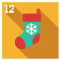
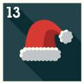
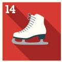
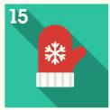
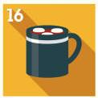
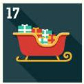
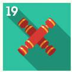
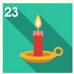

# Advent Of Code ⭐⭐

These are my solutions to Advent Of Code.

## 2023

<map name="adventmap">
  <!-- coords are left,top,right,bottom -->
  <area shape="rect" coords="0,0,100,100" href="https://github.com/lvainio/Advent-Of-Code-2023/tree/main/2023/day1" alt="Day 1" />
  <area shape="rect" coords="100,0,200,100" href="https://example.com/day2" alt="Day 2" />
  
</map>